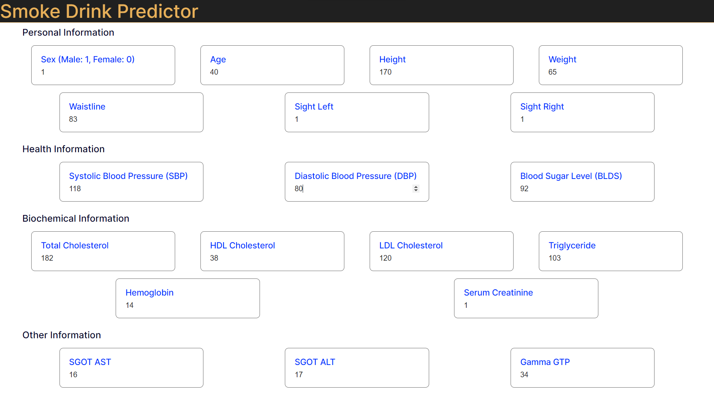
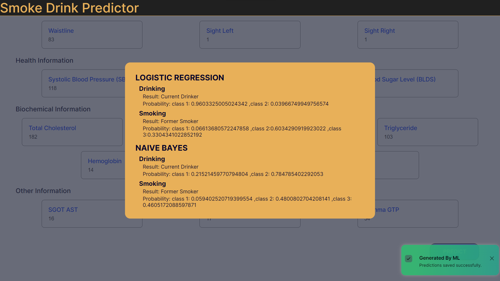
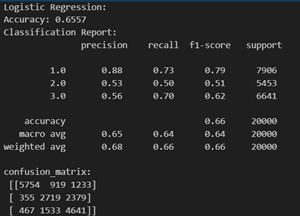
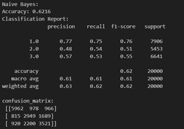
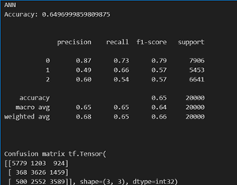
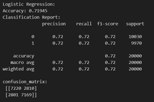
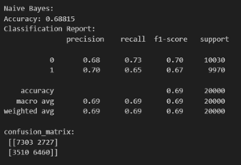
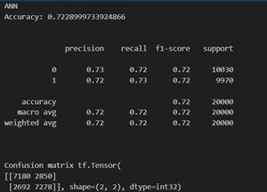

# Smoke-Drink-Predictor

Often when patients are diagnosed with a respiratory problem or health condition, they are reluctant to reveal information regarding their smoking and drinking status, that is, whether they smoke or drink and if so, how frequently. There may be several reasons ranging from fear of dismissal or appearing as someone who is careless about personal health. In any case, this leads to misinformation and difficulty for medical practitioners in providing proper treatment. Therefore, there is a need for accurate knowledge of a patient’s smoking and drinking status without having to rely on the patient’s words for the same.
It has been shown that this very information can be predicted based on several measurable body signals such as Blood Pressure, Cholesterol, Urine Proteins, and a few enzymes. Practitioners can use Machine Learning Models trained on this data available for several patients to predict the status of future patients.
This report summarizes an attempt at the problem discussed above. Details will follow.

# DATASET

The dataset for the project is the Smoking and Drinking Dataset with body signal and has been sourced from Kaggle. This dataset was collected from the National Health Insurance Service in Korea and all personal information and sensitive data were excluded.
The data contains 9,91,346 rows and 24 columns.

- Sex male, female
- Age round up to 5 years
- Height round up to 5 cm[cm]
- Weight [kg]
- Sight_left eyesight(left)
- Sight_right eyesight(right)
- Hear_left hearing left, 1(normal), 2(abnormal)
- Hear_right hearing right, 1(normal), 2(abnormal)
- SBP Systolic blood pressure[mmHg]
- DBP Diastolic blood pressure[mmHg]
- BLDS BLDS or FSG(fasting blood glucose)[mg/dL]
- Tot_chole total cholesterol[mg/dL]
- HDL_chole HDL cholesterol[mg/dL]
- LDL_chole LDL cholesterol[mg/dL]
- Triglyceride triglyceride[mg/dL]
- Hemoglobin hemoglobin[g/dL]
- Urine_protein protein in urine, 1(-), 2(+/-), 3(+1), 4(+2), 5(+3),(+4)
- Serum_creatinine serum(blood) creatinine[mg/dL]
- SGOT_AST SGOT(Glutamate-oxaloacetate transaminase) AST(Aspartate transaminase)[IU/L]
- SGOT_ALT ALT(Alanine transaminase)[IU/L]
- Gamma_GTP y-glutamyl transpeptidase[IU/L]
- SMS_stat_type_cd Smoking state, 1(never), 2(used to smoke but quit), 3(still smoke)
- DRK_YN Drinker or Not

# PRELIMINARY ANALYSIS

## Under sampling

It was observed that out of the 9,91,346 patients, around 6,00,0000 were non – smokers, which means that the proportion of patients who smoke or used to smoke is relatively small. To remove the oversampling, the number of non–smokers was reduced to 2,50,000 by random selection.

## Invariable Features

Plotting values in each column as a parameter vs. the smoking status of a patient, it was observed in the case of columns urine_protein, hear_left, and hear_right that the observed values lie in the normal range for smokers and non–smokers alike. Hence, these three parameters were not taken into consideration in making predictions.
Removing Outliers
Outliers are observations that differ considerably from other observations. Such data were removed from the dataset by deleting entries whose parameters had data points lying in the top 0.1% of the complete data. 8,433 such points were found and their removal brought down the number of entries to 6,30,472.

## Removing Outliers

Outliers are observations that differ considerably from other observations. Such data were removed from the dataset by deleting entries whose parameters had data points lying in the top 0.1% of the complete data. 8,433 such points were found and their removal brought down the number of entries to 6,30,472.

## Count plot

Count plots were made for all the remaining parameters for a random sample of 1,00,000 patients to understand their distribution better. The plots for all three types of smokers emerged similar for most of the parameters, but there were slight exceptions like in the case of hemoglobin.

## Heatmap

Along with relations to the smoking status, relations between the parameters themselves also provide important insights. A heatmap is a two-dimensional graphical representation of data where the individual values that are contained in a matrix are represented as colors. A heatmap was made to study relations among the parameters.

From the heatmap, we can see strong correlations between SBP – DBP, LDL_chole – tot_chole and SGOT_ALT – SGOT_AST. There was also a considerable correlation between sight_left – sight_right, which, being categorical variables (a variable that can take on only one of a small fixed list of values) were not plotted on the heatmap. So, we may consider reducing these parameters from 8 to 4 using methods such as PCA, SVD and LDA to reduce the number of dimensions.
At the same time, we must be careful not to reduce the number of parameters too much because there already are only 22 parameters remaining to describe around 1,00,000 data – points. Keeping this in mind, parameters were reduced only in situations where one of the three methods (PCA, SVD, LDA) resulted in a data loss of less than 0.5%.

Data loss in each case was calculated using the formula:
▭("data_loss = 1–explained_variance" ["0" ] )
Finally, LDL_chole – tot_chole, SGOT_ALT – SGOT_AST and sight_left – sight_right were reduced to a single parameter each using LDA.

# METHODOLOGY

After the initial analysis and reduction of parameters, we proceeded to the Machine Learning Models.

1. Logistic Regression
   There are 3 types of patients in the target class (non – smokers : 1, stopped smoking: 2, smoker : 3). However, Logistic Regression is generally used for binary classification. But, in the scikit learn library, the model has been extended to include multi – class classification.
   The model has been used in its default mode (‘auto’ for multi – class). Here is an exerpt from the documentation: “‘auto’ selects ‘ovr’ if the data is binary, or if solver=’liblinear’, and otherwise selects ‘multinomial’.”
2. Gaussian NB
   Naive Bayes methods are a set of supervised learning algorithms based on applying Bayes’ theorem with the “naive” assumption of conditional independence between every pair of features given the value of the class variable. More can be found here.
3. Artificial Neural Network
   The input size passed to the ANN was of size 16 and a fully feed – forward network with 10 dense layers with the activation function as RELU was created. The loss function used was Categorical Cross Entropy.

## Snapshot

### Form Page

### Result

### Models Results

#### Smoking

#### Drinking

## REFERENCES

1. [Smoking and Drinking Dataset with body signal](https://www.kaggle.com/datasets/sooyoungher/smoking-drinking-dataset)
2. [Gaussian NB](https://scikit-learn.org/stable/modules/naive_bayes.html)
